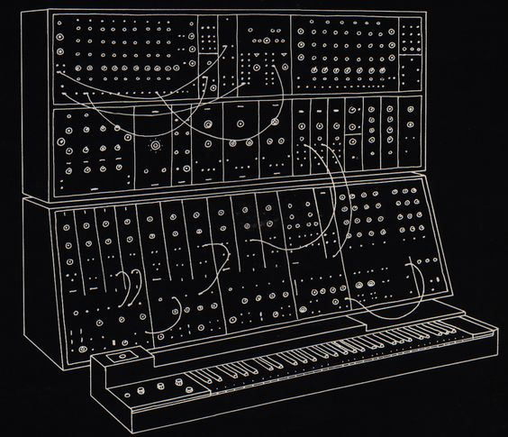

TEXT MUSIC

We type everyday.  
Letters, words, phrases, functions, objects, arrays, strings, integers, booleans. What would they sound like if read by something other than human eyes and spoken by something other than the human voice? Text Music provides one of an infinite number of answers.

The user enters a line of text which is converted and then played as notes. In this instance, each letter key represents a different note within a C major (or A minor, the white keys of a piano) scale while number keys trigger sharps/flats(the black keys).  "." is played as a rest, and blank spaces default to a low A.

Type your name. Paste in a passage or quote from your favorite book or movie. Anything entered into the field will be converted into music...or something that resembles it depending on your definition.  This musical "thing" can be saved into a database and played or deleted from there.
Tempo can be adjusted in real time using the tempo slider.

Initially intended as a generative music concept(https://en.wikipedia.org/wiki/Generative_music) the app also functions as a handy little tool for simple monophonic notation.  It's kinda fun.

Created using Node, Express, Javascript, ToneJS, SQL, and HTML/CSS.
