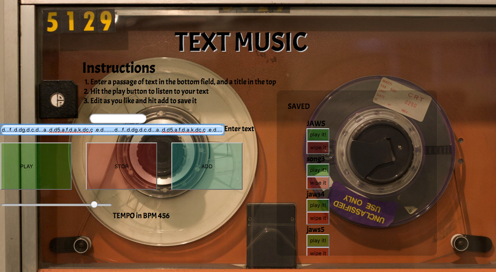

TEXT MUSIC

We type everyday.  
Letters, words, phrases, functions, objects, arrays, strings, integers, booleans. What would they sound like if read by something other than human eyes and spoken by something other than the human voice? Text Music provides one of an infinite number of answers.

The user enters a line of text which is converted and then played as notes. In this instance, each letter key represents a different note within a C major (or A minor, the white keys of a piano) scale while number keys trigger sharps/flats(the black keys).  "." is played as a rest, and blank spaces default to a low A.

Type your name. Paste in a passage or quote from your favorite book or movie. Anything entered into the field will be converted into music...or something that resembles it depending on your definition.  This musical "thing" can be saved into a database and played or deleted from there.
Tempo can be adjusted in real time using the tempo slider.

ToneJS is a Web Audio framework for creating interactive music in the browser, 

Initially intended as a generative music concept(https://en.wikipedia.org/wiki/Generative_music) the app also functions as a handy little tool for simple monophonic notation.  It's kinda fun.  I started with getting a sound to play on page load after setting output to the computer's master (the speakers), and then moving into controlling that playback with a 'play' button, a stop button, expanding the notation system for more flexibility, built a slider to control and shift tempo (in real time!) and then enabling CRUD functionality to save and delete compositions.  Future features will include editing capability after adding to database, front end audio effects, and expanded notation.

Text Music was created using Node, Express, Javascript, ToneJS, SQL, and HTML/CSS.  ToneJS(https://github.com/Tonejs/Tone.js) is a Web Audio framework for creating interactive music in the browser, enabling the notes to be played through the browser. To install:

npm install tone

Other dependencies: 

npm install --save path body-parser express 

Javascript was used to convert text into a string which is read by the tone.js engine, and node and express are used to save the user input to a SQL database.

